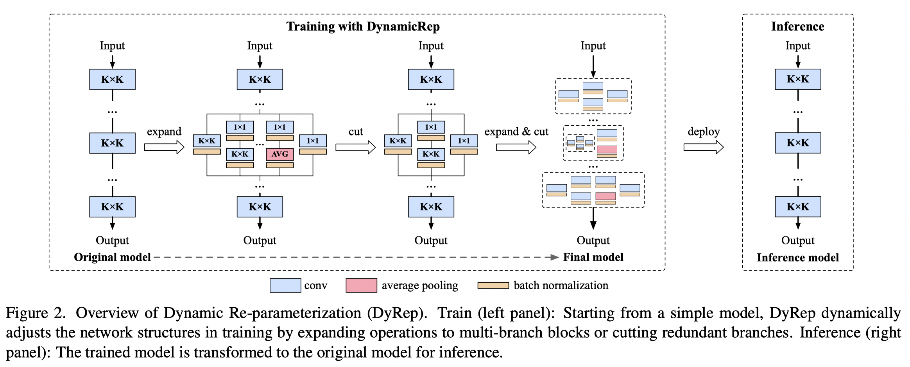

# DyRep: Bootstrapping Training with Dynamic Re-parameterization 
Official implementation for paper "[DyRep: Bootstrapping Training with Dynamic Re-parameterization](https://arxiv.org/abs/2203.12868)", CVPR 2022.

By Tao Huang, Shan You, Bohan Zhang, Yuxuan Du, Fei Wang, Chen Qian, Chang Xu.

<p align='center'>

</p>

## Updates  

### March 11, 2022  
The code is available at [image_classification_sota](https://github.com/hunto/image_classification_sota).

## Getting started  
### Clone training code  
```
git clone https://github.com/hunto/image_classification_sota
```

The prepare your environment and datasets following the `README.md` in [image_classification_sota](https://github.com/hunto/image_classification_sota).

### Implementation of DyRep  
The core concept of DyRep is in [lib/models/utils/dyrep.py](https://github.com/hunto/image_classification_sota/blob/main/lib/models/utils/dyrep.py).

## Reproducing our results  
### CIFAR  

|Dataset|Model|Config|Paper|This repo|Log|
|:--:|:--:|:--:|:--:|:--:|:--:|
|CIFAR-10|VGG-16|[config](https://github.com/hunto/image_classification_sota/blob/main/configs/strategies/DyRep/cifar.yaml)|95.22%|95.37%|[log](https://github.com/hunto/DyRep/releases/download/v1.0.0/dyrep_cifar10_vgg16.txt)|
|CIFAR-100|VGG-16|[config](https://github.com/hunto/image_classification_sota/blob/main/configs/strategies/DyRep/cifar.yaml)|74.37%|74.60%|[log](https://github.com/hunto/DyRep/releases/download/v1.0.0/dyrep_cifar100_vgg16.txt)|

* CIFAR-10
    ```
    sh tools/dist_train.sh 1 configs/strategies/DyRep/cifar.yaml nas_model --model-config configs/models/VGG/vgg16_cifar10.yaml --dyrep --experiment dyrep_cifar10_vgg16
    ```
* CIFAR-100
    ```
    sh tools/dist_train.sh 1 configs/strategies/DyRep/cifar.yaml nas_model --model-config configs/models/VGG/vgg16_cifar100.yaml --dyrep --dataset cifar100 --experiment dyrep_cifar100_vgg16
    ```

### ImageNet  

|Dataset|Model|Config|Paper|This repo|Log|
|:--:|:--:|:--:|:--:|:--:|:--:|
|ImageNet|ResNet-18|[config](https://github.com/hunto/image_classification_sota/blob/main/configs/strategies/DyRep/resnet.yaml)|71.58%|71.66%|[log](https://github.com/hunto/DyRep/releases/download/v1.0.0/dyrep_imagenet_res18.txt)|

* ResNets  
    ```
    sh tools/dist_train.sh 8 configs/strategies/DyRep/resnet.yaml resnet50 --dyrep --experiment dyrep_imagenet_res50
    ```

* MobileNetV1
    ```
    sh tools/dist_train.sh 8 configs/strategies/DyRep/mbv1.yaml mobilenet_v1 --dyrep --experiment dyrep_imagenet_mbv1
    ```

* RepVGG
    * DyRep-A2
        ```
        sh tools/dist_train.sh 8 configs/strategies/DyRep/repvgg_baseline.yaml timm_repvgg_a2 --dyrep --dyrep_recal_bn_every_epoch --experiment dyrep_imagenet_repvgg_a2
        ```
    * DyRep-B2g4 and DyRep-B3
        ```
        sh tools/dist_train.sh 8 configs/strategies/DyRep/repvgg_strong.yaml timm_repvgg_b2g4 --dyrep --dyrep_recal_bn_every_epoch --experiment dyrep_imagenet_repvgg_b2g4
        ```

## Deploying the Trained DyRep Models to Inference Models  
```
sh tools/dist_run.sh tools/convert.py ${GPUS} ${CONFIG} ${MODEL} --resume ${CHECKPOINT}
```

For example, if you want to deploy the trained ResNet-50 model with the best checkpoint, run  
```
sh tools/dist_run.sh tools/convert.py 8 configs/strategies/DyRep/resnet.yaml resnet50 --dyrep --resume experiments/dyrep_imagenet_res50/best.pth.tar
```

Then it will run test before and after deployment to ensure the accuracy will not drop.

The final weights of the inference model will be saved in `experiments/dyrep_imagenet_res50/convert/model.ckpt`.

## Citation  
```
@article{huang2022dyrep,
  title={DyRep: Bootstrapping Training with Dynamic Re-parameterization},
  author={Huang, Tao and You, Shan and Zhang, Bohan and Du, Yuxuan and Wang, Fei and Qian, Chen and Xu, Chang},
  journal={arXiv preprint arXiv:2203.12868},
  year={2022}
}
```
